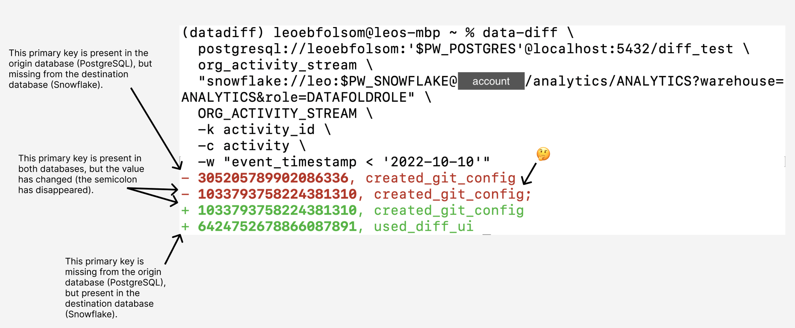

#### **data-diff** data-diff enables data professionals to detect differences in values between any two tables. 
It's fast, easy to use, and reliable. Even at massive scale.

[Join us on GitHub](https://github.com/datafold/data-diff#readme) if you'd like to contribute to this open source library!

[TODO replace this draft image]

### But first, what's a diff?

Diffing compares two files and tells you how they're different. It's there for you when your test suite doesn't cover every edge case.

You already know about `git diff`, which helps code reviewers see what's changed. A `data-diff` does the same thing, but between two data tables.

### Cool, but I already have a test suite.

You sure do! And that will catch any errors that you've written a test for. `data-diff` is different because it will alert you to _any_ changes in the data.

For example, if you write a test to check if a primary key is `unique` and `not_null`, that won't catch if your code change or data migration has caused certain primary keys to disappear💨, or to be slightly altered😱. That's where `data-diff` comes in.

### Oh, you'd like a list of amazing things `data-diff` can do?

* ⇄  Verifies across [many different databases][#] [TODO add link to DBs] (e.g. PostgreSQL ⇄ Snowflake) or within a database
* 🔍 Outputs [diff of rows](#example-command-and-output) in detail
* 🚨 Simple CLI/API to create monitoring and alerts
* 🔁 Bridges column types of different formats and levels of precision (e.g. Double ⇆ Float ⇆ Decimal)
* 🔥 Verify 25M+ rows in <10s, and 1B+ rows in ~5min.
* ♾️  Works for tables with 10s of billions of rows

Read more about our [common use cases](./common_use_cases) or jump right in and [install data-diff](./how_to_install) and run your first diff.